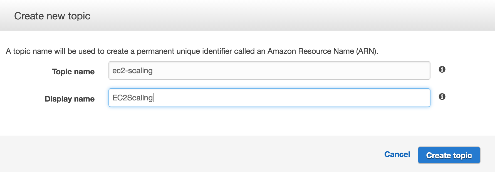
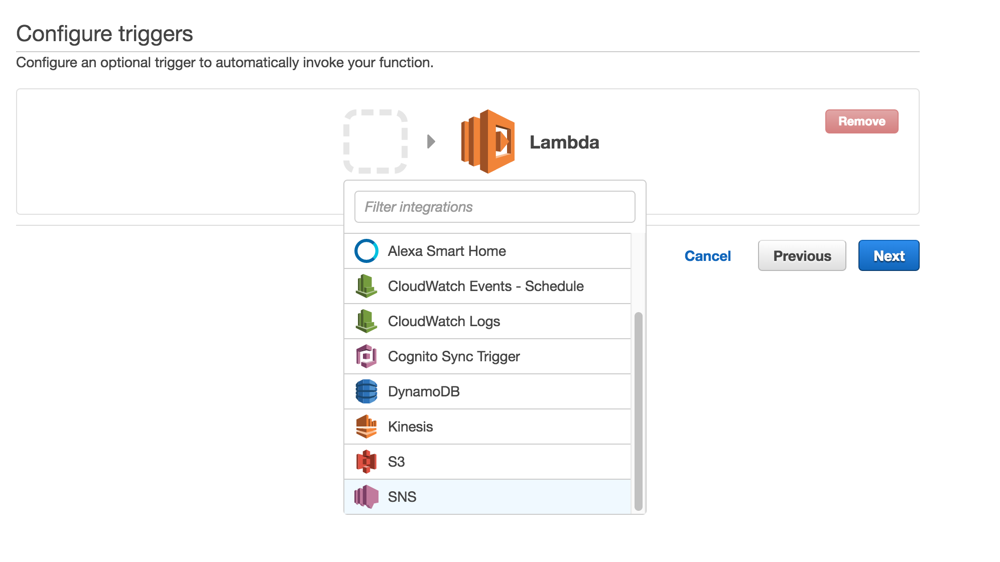
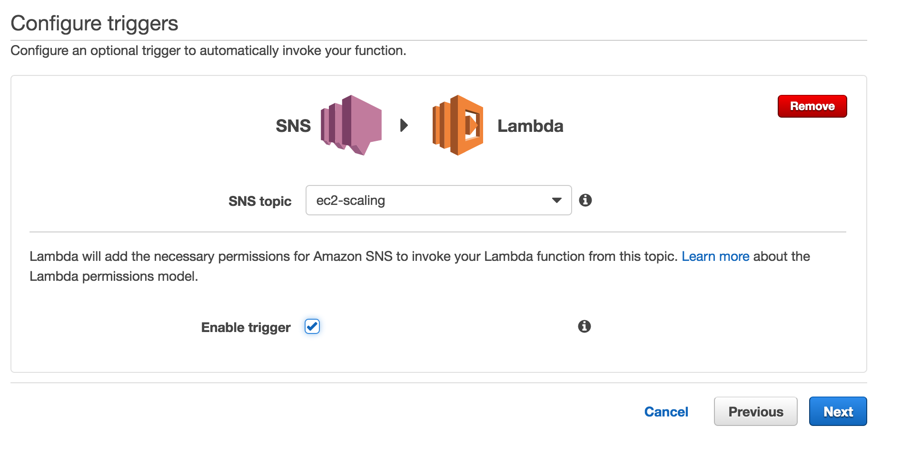
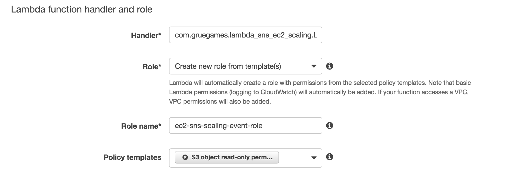
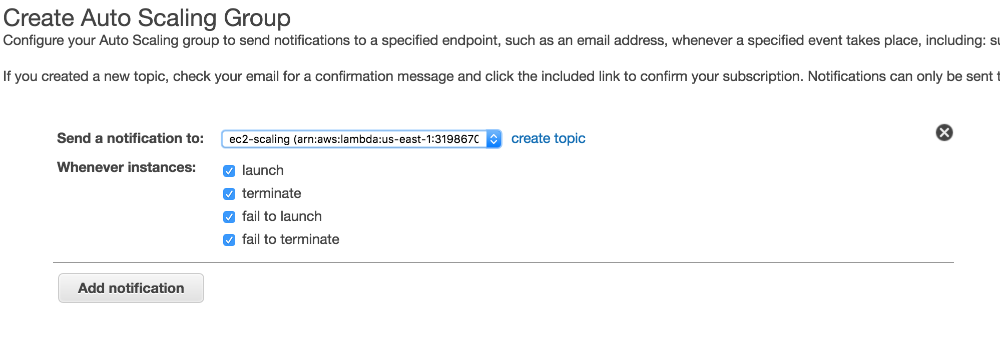

# lambda_sns_ec2_scaling
Java application to handle ASG scaling events through SNS/Lambda

## What it does

While AWS auto scaling groups (ASG) are fantastic, there is event system in AWS to handle the scaling up or down of ASG. This means you would have to manage all instance changes between AWS and your own management infrastructure.

What AWS does give you, however, is a way to fire a push notification to a Lambda event. It's up to you to figure out what do to with that event once it's fired. 
 
This code is a simple Java application to help you handle those events. The current examples in the code use Salt and Slack, but can be customized for almost anything ([See below](#customize_event))

## How to build, setup and use

### Set up the application

1. Clone the repo.

```
git@github.com:gruegames/lambda_sns_ec2_scaling.git
```

2. Copy `src/main/resources/ec2.properties.tmp` to `src/main/resources/ec2.properties` and enter your AWS access information.

```
aws.access.key.id=<aws_access_id>
aws.secret.access.key=<aws_secret_key>
```

3. Copy `src/main/resources/salt.properties.tmp` to `src/main/resources/salt.properties` and enter your Salt/EC2 user access information.

```
ec2.username=<valid_ec2_username>
ec2.password=<valid_ec2_password>

salt.master.minion=<salt_minion_to_fire_event>
salt.url=<salt_api_url>
```

3. Copy `src/main/resources/slack.properties.tmp` to `src/main/resources/slack.properties` and enter your Slack access information.

```
slack.api_key=<slack_bot_token>
slack.url=https://slack.com/api/chat.postMessage
slack.channel=<slack_channel>
slack.username=<slack_bot_username>
```

4. Run `mvn clean package`.

5. Copy `target\lambda_sns_ec2_scaling-1.0-SNAPSHOT.jar` to S3 and grab the URL.

### Set up AWS SNS and Lambda to use

1. Create a new SNS topic to be used.



2. Create a new Lambda job to handle this event.
* Skip the 'Select blueprint' step.
* Select SNS as the trigger option.
  


* Select the SNS topic that was just created and enable trigger.
  


* Set up the 'Configure function' section.


* Set up the 'Lambda function code' section with the S3 URL from the jar uploaded above.


* Set up the 'Lambda function handler and role' section. Use 'com.gruegames.lambda_sns_ec2_scaling.LambdaFunction::handleRequest' for the 'Handler' field.



* Click 'Advanced settings' and set the memory and timeout to the settings below. Waiting for an EC2 instance to spin up can take some time.


* Select your default VPC, subnets, and security group. Make sure that your security group can talk to the default VPC security group.
* Click next and then 'Create Function' on the next page.

### Set up an AWS EC2 Auto Scaling Group

1. Under 'EC2 -> Launch Configurations', click 'Create Auto Scaling Group'.
2. Click 'Create Launch Configuration'.
3. Select your AMI (I prefer Ubuntu Server 14.04).
4. For instance type use 't2.micro' and click 'Next'.
5. Name your launch configuration and click 'Next'.
* Note: you will probably want to also assign an IAM role as well. At least for your EC2 instances to access S3.


6. Click next unless you want to add storage.
7. Select the default VPC security group and click 'Review'.
8. Click 'Create launch configuration'.
9. Select your default key pair. If you do not have one create one and download it.
10. Give your ASG a name, and select your default VPC and subnets to match the ones above. Click 'Next'.
11. Leave 'Keep this group at its initial size' selected and click 'Next: Configure Notifications'.
* Note: you can always change this later.
12. Click 'Add Notification' and make sure the SNS topic you created is selected. Click 'Next: Configure Tags' to add tags.



13. Add the tags you want and click 'Review'
* Note: I highly recommend having the following tags: Name, Role, Environment, and Project, but the tags are up to you.
14. Launch the Auto Scaling Group.

To see the output, go to 'Lambda -> ec2-sns-scaling-event -> Monitoring' and click on 'View logs in CloudWatch'.

## Customize the event handler<a name="customize_event"></a>

## Customize the alarm handler<a name="customize_alarm"></a>